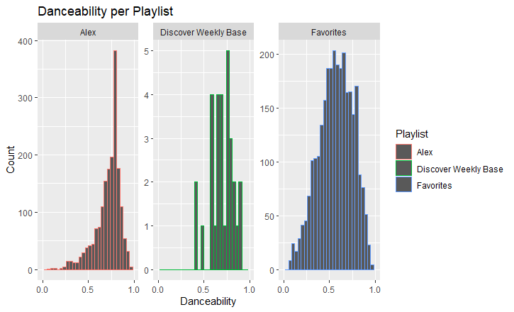

# Computational_Musicology_Portfolio
Computational Musicoloy Course @ UvA

## My Topic
As a very enthiousiastic user of Spotify I have a list called "Favourites", which I have been using since 2014. I listen to this playlist daily and add new songs to it when finding songs that I like, this will be an important factor for later. As I always want to find new tunes, every week I listen to my Discover Weekly playlist that spotify so kindly makes for me. Based on some research (for instance [this article](https://qz.com/571007/the-magic-that-makes-spotifys-discover-weekly-playlists-so-damn-good/)). I have a general idea of how spotify creates this Discover Weekly playlist and picks songs specifically for you. Two big factors that influence the songs that it will pick for you are when you ad new songs to a playlist and if you listen to songs a lot. Meaning that if I start adding/saving only techno songs from now on and only listen to techno songs, my discover weekly will probably provide me with more techno songs.

As my Discover Weekly playlists are based on songs I save and play often, I therefore could reason that the songs chosen for my Discover Weekly playlist are based mostly on tunes from my "Favourites" playlist, as I've been mainly using that over the past few years. And if I would start listening to for instance **ONLY** my boyfriends "Favourites" playlist, my discover weekly would change. Meaning that it will provide me with more songs that are based on his music taste. I should be able to see my discover weekly change over time.

## How to find out?
To test this idea I will first give you a summary of some interesting features of my "Favourites" playlist. I will compare this to a summary of features of my discover weekly playlist, to see if they are sort of the same. If they are not totally the same, this is not a weird thing, as the Discover Weekly playlist is also based on more recent listening behavior and my "Favourites" playlist has been going on since 2014, see article. Then I will give a summary of some features of my boyfriends playlist. We will compare the three and look at the differences. The next step would be that for the coming 8 weeks, I will listen only to my boyfriends playlist and see if my Discover Weekly playlist will change over time and will start looking more like my boyfriends playlist. It will automatically save my Discover Weekly's in a playlist, as there actually is a setting for that (if you're interested: <https://ifttt.com/applets/313481p-save-your-discover-weekly-tracks-to-a-playlist>).

You don't have to worry about the fact that I could also listen to my discover weekly, as the discover weekly algorithm does not take listening behavior of the discover weekly songs itself into account when calculating what new songs to give you for you Discover Weekly.

## The features I chose (might add more later)
Here are some interesting features of the three playlists. I picked danceability, energy, instrumentalness and tempo. **Danceability** shows how suitable a track is for dancing based on tempo, rhythm stability, beat strength and overall regularity.A value of 0.0 is least danceable and 1.0 is most danceable. **Energy** shows a measure of intensity and activity. Energetic songs are supposed to be fast, loud and noisy. This is measured from 0 to 1, with 1 being a very energitic song. **Instrumentalness** shows if a track contains no vocals. This ranges from 0 to 1, where values closer to 1 would mean that it's more likely that the track contains no vocals. Lastly **tempo**, this is just measure in beats per minute (BPM). Thus the speed/pace of the song.

I picked danceability because Alex's playlist contains mostly techno/house/electronic music, whereas my Favourites also contains quite some guitar/punk/metal music from some years back, but also  techno/house/electronic music from the recent years, which could thus be interesting to look at. I was also interested in the average tempo and energy of the songs, is I thought they would be rather the same for my Favourites and Alex's Favourites, however I think Discover Weekly in general tends to also give me songs with lower BPM's than I usually listen to. Instrumentalness also seemed interesting as I nowadays listen mostly to songs without vocals, and I think Alex's playlist also contains mostly no vocals, but discover weekly I think will have a bit more.

## The Measurements of Spotify 

**My Favourites**

|Feature   |Mean   |SD   |
|---|---|---|
| Danceability  | 0.567  |0.184   |
| Energy  | 0.635  |  0.265  |
| Instrumentalness  | 0.329   | 0.373  |
| Tempo  |  124  | 31  |
  

**Alex's Favourites**

| Feature  |Mean   |SD   |
|---|---|---|
| Danceability  | 0.693   |0.125   |
| Energy  | 0.664   |  0.167  |
| Instrumentalness  | 0.530    | 0.351  |
| Tempo  |   116   | 16   |

**Discover Weekly**

|Feature   |Mean   |SD   |
|---|---|---|
| Danceability  | 0.717   |0.138   |
| Energy  | 0.681  |  0.184  |
| Instrumentalness  | 0.505  | 0.391  |
| Tempo  |  121 | 19.8   |

### Some differences

**Danceability** has the lowest value for my Favourites (M = 0.567, SD = 0.184), discover weekly is slightly bigger (M = 0.693, SD = 0.123) and Alex's Favourites even bigger (M = 0.717, SD = 0.138). Why, I'm not sure.

For **Energy** my Favourites also has the lowest value (M = 0.635, SD = 0.265, then discover weekly (M = 0.664, SD = 0.167) and then Alex (M = 0.681, SD = 0.184) again. Which I guess would make sence, is it probably is somewhat correlated to danceability.

For **Instrumentalness** my Favourites is very low (M = 0.329, SD = 0.373) in comparison to my discover weekly (M = 0.530, SD = 0.351) and Alex's playlist (M = 0.505, SD = 0.391). Indicating that I probably have more songs with vocals in my Favourites compared to the other playlists. Which could make sense as there are old songs in my Favourites (metal/punk/rock), whilst in Alex's there are not a lot, and discover weekly is mostly based on recent listenings (which are mostly electronic/house/techno for me, thus there will probably be less vocals in my discover weekly).

The **tempo** is the highest for my Favourites (M = 124, SD = 31), the lowest for discover weekly (M = 116, SD = 16) and in the middle for Alex's Favourites (M = 121, SD = 19.8). 

I also looked at the popularity of the playlists, however when comparing them I found out that there is a huge difference between my favourties (M=16.2, SD=22.0) and Alex's playlist (M=18.9, SD=21.2) compared to the discover weekly playlist (M=35.3, SD=7.19). Appareantly this is because the Discover Weekly algorithm is biased to provide you with songs that are populair in general. You can also see this in the SD, as for mine and Alex's playlist the SD is huge and for the Discover Weekly it is less big.

### Outliers
As my Favourites consist of 2663 songs, outliers are not gonna have a lot of impact on the results. The same holds for Alex's Favourites, as this playlist contains 1704 songs. However Discover Weekly, right now, only contains 30 songs, thus outliers could have a big influence. Looking at some plots of the Discover Weekly we see that overall danceability, energy and instrumentalness are all very spread out over the values. However for tempo, most of the songs are 105-135 BPM, with two outliers, 1 song has a BPM of only 77 and one song has a BPM of 175! After finding out which song it was that had 175 BPM (Umboweti - Original Mix) I concluded it was a miscalculation of the BPM value. However, if you take out these 2 outliers, it could be possible that the mean and the SD will change.

## The Planning
Now that we have this baseline comparison, I will start listening only to ALex's playlist. I will add songs of this playlist, that I like ofcourse, to my Favourites. I will keep checking and saving my Discover Weekly playlists. Then hopefully over time, we will see some kind of change in my Discover Weekly playlist, and at the end we can look at the progress over time and compare it to the baseline, again and see if there are any changes for values of the features.

## Visualisation

There are 3 things I want to visualize. 
__1.__ The baseline differences.
__2.__ The changes over time for discover weekly.
__3.__ The end differences

#### 1. The baseline differences:
These are the visualisations for the features danceability, energy, tempo and instrumentalness for the different playlists: Alex's favourites, my favourites, and the discover weekly of week We use these plots to look at the baseline differences.

We can also plot multiple of these features in 1 graph.

However because Alex's and my playlist have so many songs, it becomes a bit hard to see what's going on. Therefore we take a sample of 500 songs from Alex's and my playlist and reconstruct this plot.

#### 2. The changes over time for discover weekly.
This will be a plot showing how the features will change for the discover weekly playlist over time.

#### 3. The end differences.

